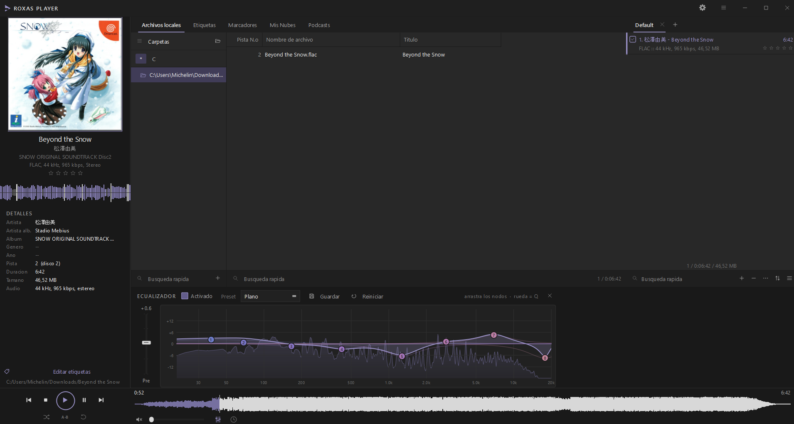

# Ryxus Player

Reproductor de audio de escritorio en C++17 / Qt 6 para Windows: interfaz
oscura de tres columnas, ecualizador paramétrico de 12 bandas con espectro en
vivo, rack de efectos y editor de etiquetas que escribe de verdad sobre el
archivo.



---

## Qué trae

**Motor de audio propio** sobre [miniaudio](https://miniaud.io) — MP3, FLAC,
WAV, OGG y compañía. El dispositivo se abre una sola vez a 48 kHz / f32 y el
decodificador convierte a ese formato, así que cambiar de pista no produce
cortes ni clics.

**Ecualizador paramétrico de 12 bandas** al estilo del EQ Eight de Ableton: los
nodos se arrastran en los dos ejes (horizontal = frecuencia, vertical =
ganancia), la curva se arma pasando por ellos y de fondo se dibuja el espectro
del audio en tiempo real, analizado con una FFT de 16384 puntos para que el
grave no salga dibujado a tramos. Filtros *peaking* biquad en cascada más
preamplificador, y 11 presets de fábrica además de los que guardes.

**Rack de efectos** que se despliega bajo el ecualizador, también al estilo de
la cadena de dispositivos de Ableton: compresor, saturación, chorus, eco,
reverberación y amplitud estéreo. Cada módulo se enciende por separado y
recuerda sus mandos entre sesiones.

**Editor de metadatos a página completa**, en su propia pestaña *Etiquetas*:
título, artista, artista del álbum, álbum, género, compositor, año, pista,
disco, comentario y calificación, con la carátula al lado. Escribe de verdad
sobre el archivo con TagLib, y la carátula se puede reemplazar, exportar o
quitar.

**Veinte temas de color** — Violeta nocturno, Ámbar, Bosque, Océano, Carmesí,
Nord, Monocromo, Medianoche, Cereza, Cobre, Menta, Grafito, Neón, Drácula,
Gruvbox, Solarizado, Tokio noche y tres claros (Papel, Arena, Nieve) — que se
cambian en vivo, sin reiniciar.

**Imagen de fondo con transparencia ajustable**, con control de ajuste
(cubrir / ajustar / estirar / mosaico), transparencia de los paneles y
oscurecido de la imagen.

**Interfaz en español e inglés.**

Y además: explorador de carpetas al estilo de VS Code (se *abren* carpetas
concretas y cada una queda como raíz, con carga perezosa al desplegar), lista
de archivos con columnas configurables, varias listas de reproducción en
pestañas, forma de onda real en la barra de posición, analizador de onda y
espectro, bucle A-B, orden aleatorio, repetición y búsqueda rápida en los tres
paneles.

---

## Compilar

Dependencias: **Qt 6.8+**, **TagLib 2.x**, CMake 3.21+ y un compilador C++17.
miniaudio ya viene incluido en `third_party/`.

```bat
cmake -S . -B build -G Ninja -DCMAKE_BUILD_TYPE=Release ^
      -DCMAKE_PREFIX_PATH=C:/Users/<usuario>/Qt/6.8.3/msvc2022_64 ^
      -DCMAKE_TOOLCHAIN_FILE=C:/Users/<usuario>/vcpkg/scripts/buildsystems/vcpkg.cmake ^
      -DVCPKG_TARGET_TRIPLET=x64-windows
cmake --build build
```

El ejecutable y las DLL de Qt quedan en `build/bin/RyxusPlayer.exe`
(`windeployqt` se ejecuta solo al terminar la compilación).

Para instalar las dependencias desde cero:

```bat
python -m pip install aqtinstall
python -m aqt install-qt windows desktop 6.8.3 win64_msvc2022_64 -O C:/Users/<usuario>/Qt
vcpkg install taglib:x64-windows
```

---

## Instalar

En [Releases](https://github.com/michelinlabs/ryxus-player/releases) hay un
instalador de Windows: descarga `RyxusPlayer-x.y.z-win64-setup.exe`, ejecutalo
y listo. Crea el acceso directo en el menu inicio, se registra en *Programas y
caracteristicas* para desinstalarlo como cualquier otro programa, y opcional-
mente asocia los formatos de audio. Si no lo ejecutas como administrador se
instala solo para tu usuario, sin pedir permisos.

El instalador lleva dentro Qt, TagLib y el runtime de MSVC: no hace falta
instalar nada mas.

Para construirlo tu mismo hace falta [Inno Setup 6](https://jrsoftware.org/isinfo.php):

```bat
cmake --build build --target installer
```

Deja el `.exe` en `build/installer/`.

---

## Usar

```bat
RyxusPlayer.exe                          REM abre donde lo dejaste
RyxusPlayer.exe "D:\musica"              REM abre una carpeta y la reproduce
RyxusPlayer.exe "tema.flac" "otro.mp3"   REM sirve como "Abrir con..."
```

### Atajos

| Tecla | Acción |
|---|---|
| `Espacio` | Reproducir / pausa |
| `Ctrl` + `→` / `←` | Pista siguiente / anterior |
| `Ctrl` + `↑` / `↓` | Subir / bajar volumen |
| `Ctrl` + `E` | Mostrar u ocultar el ecualizador |
| `Ctrl` + `O` | Abrir archivos |
| `Ctrl` + `K` | Abrir carpeta |
| `Enter` | Reproducir la selección de la lista central |
| `Ins` | Añadir la selección a la lista de reproducción |
| `F4` | Abrir la pestaña de etiquetas |

### Detalles que no se ven a primera vista

- En el ecualizador: arrastra un nodo para moverlo en frecuencia y ganancia,
  `Shift` mientras arrastras lo fija en frecuencia, la rueda encima abre o
  cierra su campana (Q), doble clic lo reinicia y clic derecho lo devuelve a
  0 dB sin moverlo de sitio.
- Clic derecho en la cabecera de la lista central para elegir qué columnas se
  ven.
- Clic en el analizador del panel izquierdo para alternar entre forma de onda
  y espectro.
- El botón del reloj alterna entre tiempo transcurrido y restante.
- El botón `A-B` marca inicio, fin y limpia, en ese orden.
- Las estrellas se pueden calificar directamente desde la lista de la derecha,
  y la nota se guarda en el archivo.

---

## Estructura

```
src/core/     Equalizer, AudioEngine, SpectrumAnalyzer, MetadataService,
              PlaylistModel, LibraryScanner, WaveformWorker, Settings, Lang
src/ui/       MainWindow y los paneles; Theme.h concentra toda la paleta,
              EqCurveEditor es el plot de nodos del ecualizador y
              MetadataEditor la pestaña de edición de etiquetas
res/          ryxus.qss (hoja de estilos con tokens @color), ryxus.ico y
              ryxus.rc (icono y metadatos del ejecutable en Windows)
installer/    plantilla del instalador de Inno Setup
third_party/  miniaudio
```

La paleta vive en un único sitio, `src/ui/Theme.h`. `Theme::styleSheet()`
sustituye los tokens `@panel`, `@accent`, etc. de `res/ryxus.qss` por los
colores del tema activo, y emite `rgba()` para los tokens de fondo cuando hay
una imagen detrás.

Las medidas del layout viven juntas en `Theme::Metrics`: barra de título
36 px, franja de pestañas 35, columna izquierda 285, árbol 208, panel derecho
375, barra inferior 85. Ojo al comparar capturas: con el escalado de Windows
al 110 % todo sale un 10 % más grande en píxeles físicos.

---

## Notas de implementación

- El espectro usa una FFT de 8192 puntos (5,9 Hz de resolución). En graves una
  banda cae dentro de un solo bin, así que ahí se interpola entre bins vecinos:
  sin eso el contorno sale a escalones por debajo de ~200 Hz.
- El analizador toma la señal **antes** del volumen; si no, bajar el volumen
  aplastaría el espectro del ecualizador.
- El final de pista lo marca `MA_AT_END` del decodificador, no el número de
  frames devueltos: una lectura parcial es normal a mitad de tema y deducirlo
  de ahí hacía saltar de pista antes de tiempo.
- La hoja de estilos se empaqueta con `qt_add_resources`, no dejando el `.qrc`
  suelto entre las fuentes: `qt_standard_project_setup()` activa AUTOMOC y
  AUTOUIC pero **no** AUTORCC, y un `.qrc` en la lista de fuentes no se
  compilaría nunca (`QFile(":/res/...")` fallaría en silencio).
- La traducción no usa `.ts`/`.qm`: el español es el idioma de origen y las
  cadenas del código son la clave de una tabla en `src/core/Lang.cpp`. El
  cambio de idioma necesita reiniciar, y la ventana de configuración lo ofrece.

---

## Pendiente

- Edición de etiquetas en lote (ahora se edita pista a pista).
- Las pestañas *Mis Nubes* y *Podcasts* están en la interfaz para respetar la
  disposición de la referencia, pero no tienen servicio detrás: muestran un
  aviso en vez de fingir contenido.

---

## Licencia

Código propio bajo **MIT** (ver [`LICENSE`](LICENSE)).

Las dependencias conservan la suya: Qt 6 (LGPLv3) y TagLib (LGPL 2.1 / MPL 1.1)
se enlazan dinámicamente y se distribuyen como DLL reemplazables; miniaudio es
de dominio público / MIT-0. El detalle está en
[`THIRD-PARTY-NOTICES.md`](THIRD-PARTY-NOTICES.md).

La disposición y la paleta se inspiran en los reproductores de escritorio
clásicos de estilo oscuro, pero **no se usa ningún código, recurso ni skin de
AIMP ni de ningún otro reproductor**: los iconos están dibujados por código con
`QPainter`, la hoja de estilos es propia y el motor de audio se escribió desde
cero sobre miniaudio.
